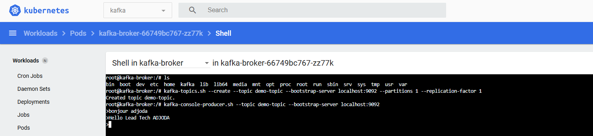
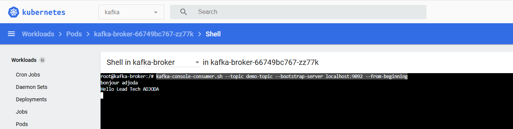

# I finally use bitnami/kafka 
  kubectl apply -f kafka-bitnami.yaml

# Dans le pod kafka

kafka-topics.sh --create --topic demo-topic --bootstrap-server localhost:9092 --partitions 1 --replication-factor 1
kafka-console-producer.sh --topic demo-topic --bootstrap-server localhost:9092
kafka-console-consumer.sh --topic demo-topic --bootstrap-server localhost:9092 --from-beginning

https://dzone.com/articles/how-to-deploy-apache-kafka-with-kubernetes