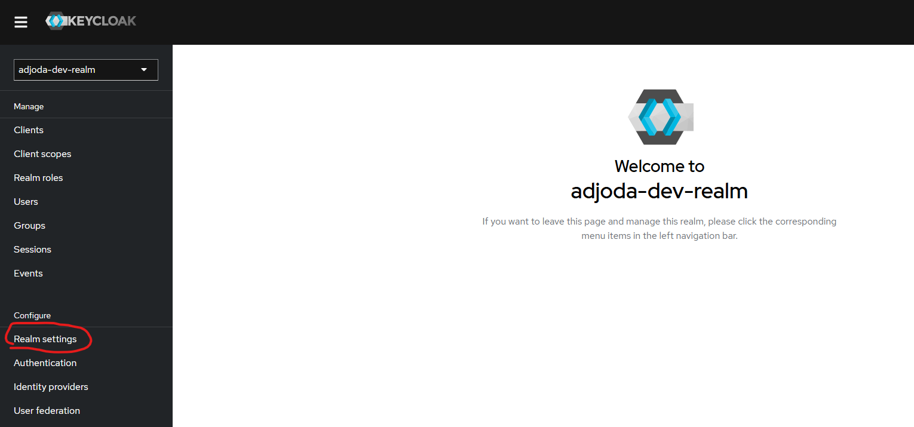
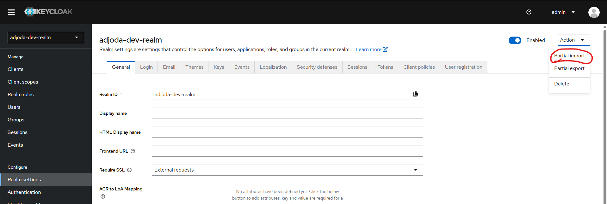
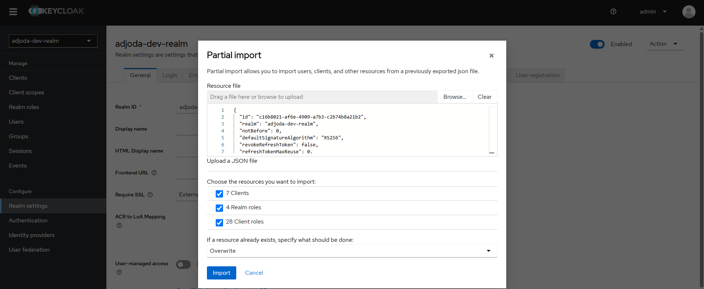
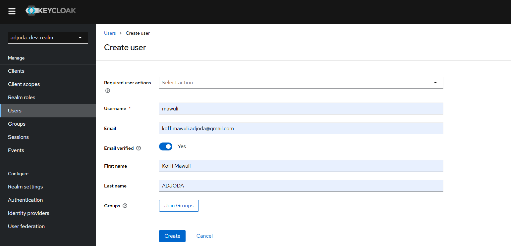
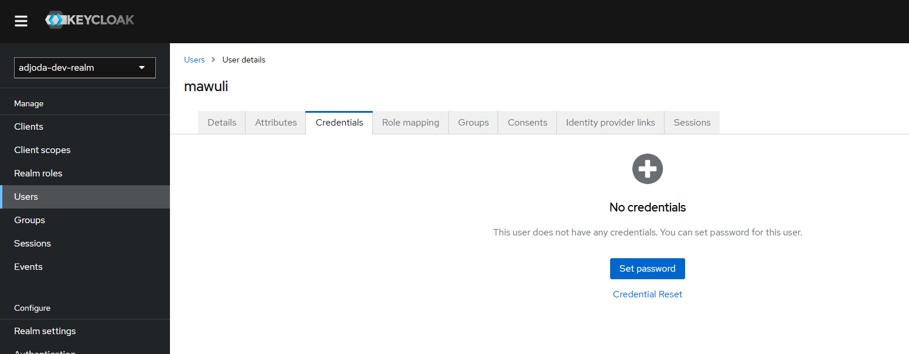
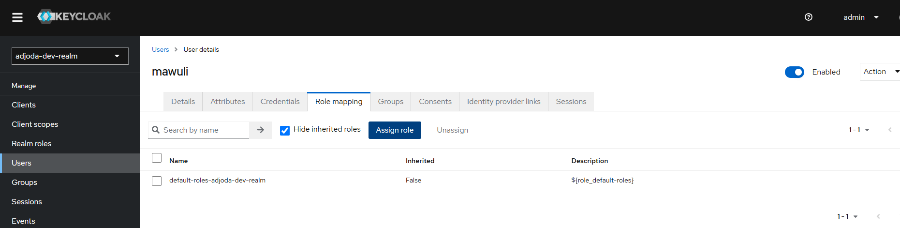
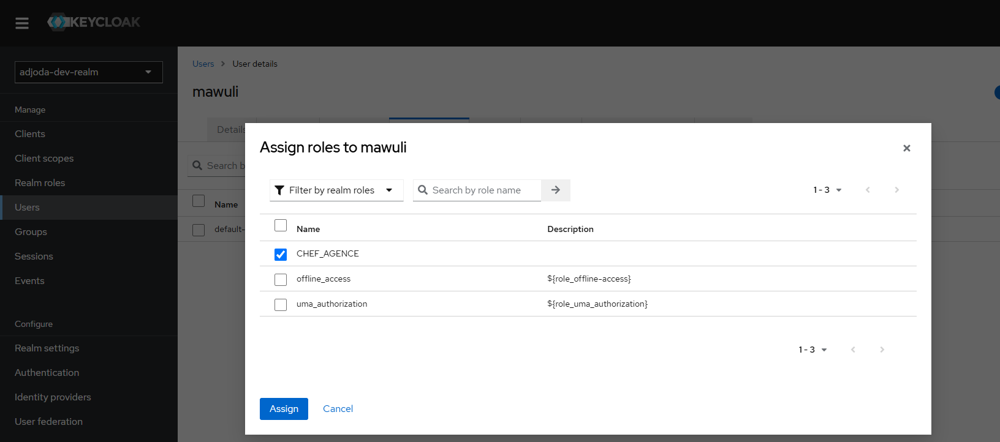

# keycloak en https
mkdir certs
openssl req -x509 -newkey rsa:2048 -keyout certs/key.pem -out certs/cert.pem -days 365 -nodes -subj "/CN=localhost"

cd /mnt/d/dev/git/dev-blog/ecommerce-project/local-deploy/keycloak/certs$

docker run -p 8443:8443 \
-e KEYCLOAK_ADMIN=admin \
-e KEYCLOAK_ADMIN_PASSWORD=admin \
-v "$(pwd)/cert.pem:/opt/keycloak/cert.pem:ro" \
-v "$(pwd)/key.pem:/opt/keycloak/key.pem:ro" \
quay.io/keycloak/keycloak:23.0.6 start-dev \
--https-certificate-file=/opt/keycloak/cert.pem \
--https-certificate-key-file=/opt/keycloak/key.pem \
--https-port=8443

# ngrok
https://dashboard.ngrok.com/domains
ngrok http https://localhost:8443 --url=keycloak.adjoda.com.ngrok.app

# go to https://keycloak.adjoda.com.ngrok.app
   login: amdin 
   pwd: admin

# create realm
  1. 
  2. 
  3. 
  4. 
  5.  the file is located \ecommerce-project\local-deploy\keycloak\realm-export.json
  6.  create user
  7. 
  8. 
  9. 

# l'installation de keycloak dans kubernetes ne marche pas avec l'ingress. car le token-service contient l'ingress et non le DNS de keycloak dans le cluster
==> solution utiliser plus tard une external IP donc LoadBalancer

curl https://keycloak.adjoda.com.ngrok.app/realms/adjoda-dev-realm