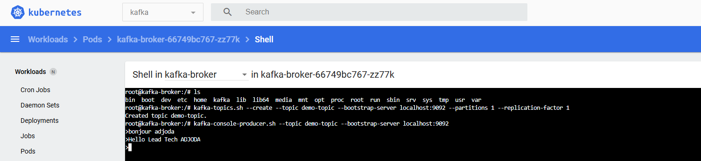
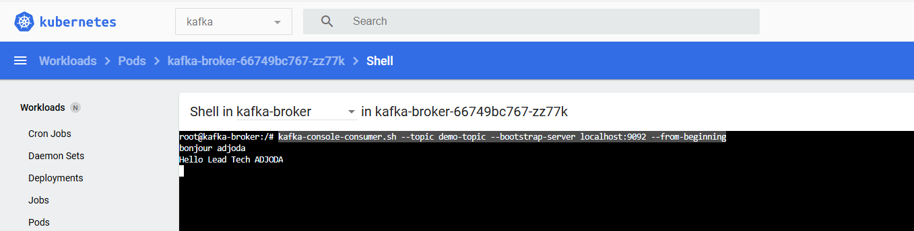

# I finally use bitnami/kafka 
  kubectl apply -f kafka-bitnami.yaml

# not used anymore
# kubectl apply -f 00-namespace.yaml
# kubectl apply -f 01-zookeeper.yaml
# kubectl get services -n kafka
#    NAME                TYPE       CLUSTER-IP      EXTERNAL-IP   PORT(S)          AGE
#    zookeeper-service   NodePort   10.110.137.48   <none>        2181:30181/TCP   12s

# put zookeeper cluster-ip in 02-kafka.yaml line 37 
# kubectl apply -f 02-kafka.yaml

# That's all. got to kafka pod in the dahboard page using these command

kafka-topics.sh --create --topic demo-topic --bootstrap-server localhost:9092 --partitions 1 --replication-factor 1
kafka-console-producer.sh --topic demo-topic --bootstrap-server localhost:9092
kafka-console-consumer.sh --topic demo-topic --bootstrap-server localhost:9092 --from-beginning

https://dzone.com/articles/how-to-deploy-apache-kafka-with-kubernetes