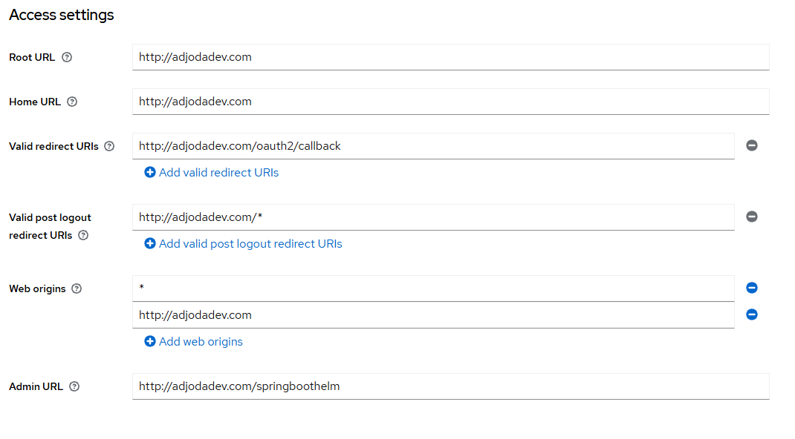

./mvnw clean package -DskipTests
docker build -t adjodamawuli/spring-boot-helm:1.0.0 .
docker run -p 8080:8080 adjodamawuli/spring-boot-helm:1.0.0
docker push adjodamawuli/spring-boot-helm:1.0.0

minikube start
minikube dashboard
minikube tunnel

https://dashboard.ngrok.com/domains
https://dashboard.ngrok.com/get-started/your-authtoken
ngrok config add-authtoken $YOUR_AUTHTOKEN

ngrok http https://localhost:8443 --url=keycloak.adjoda.com.ngrok.app

ngrok service stop

# /etc/hosts

127.0.0.1 pgadmin.localhost
127.0.0.1 keycloak.localhost
127.0.0.1 adjodadev.com
127.0.0.1 whoami.localhost
127.0.0.1 my-app.local

curl -i -H "Host: adjodadev.com" -H "Cookie: _oauth2_proxy=<ton_cookie>" http://127.0.0.1/springboothelm/api/v1/hello
