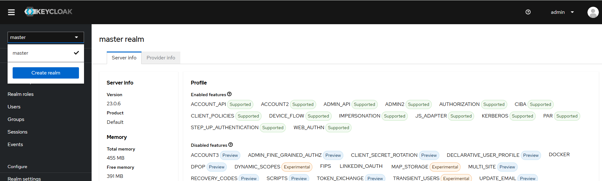
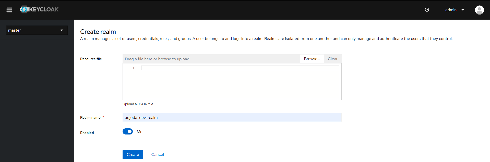
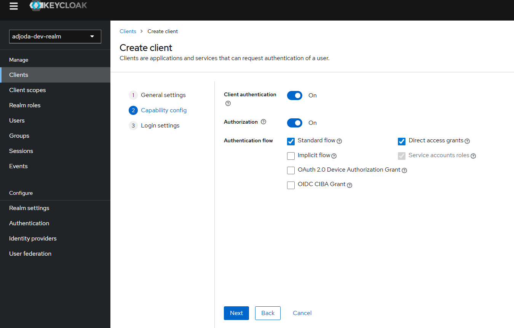
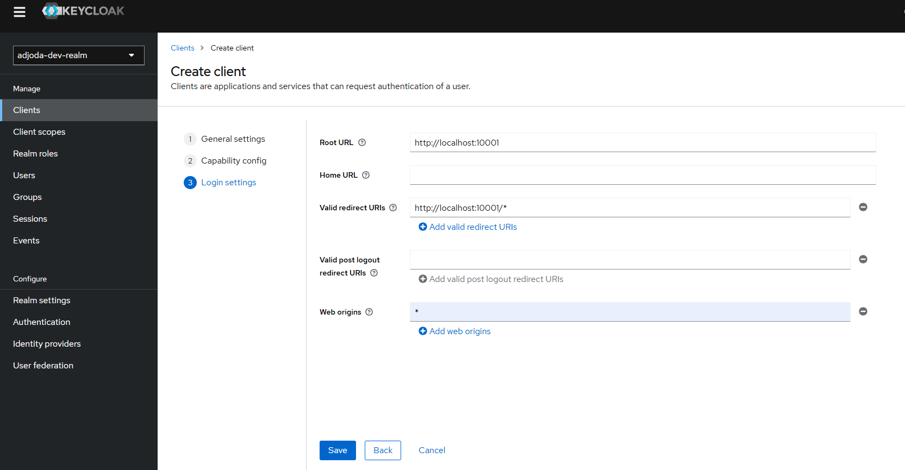
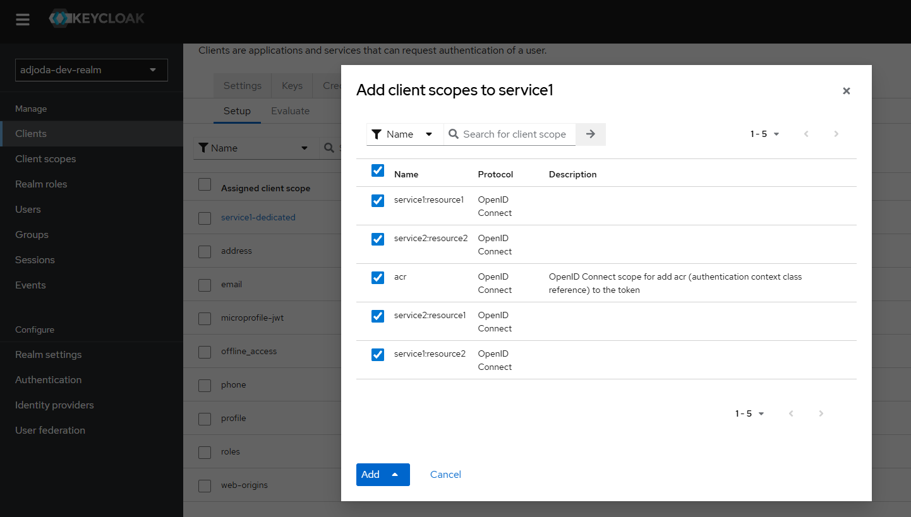
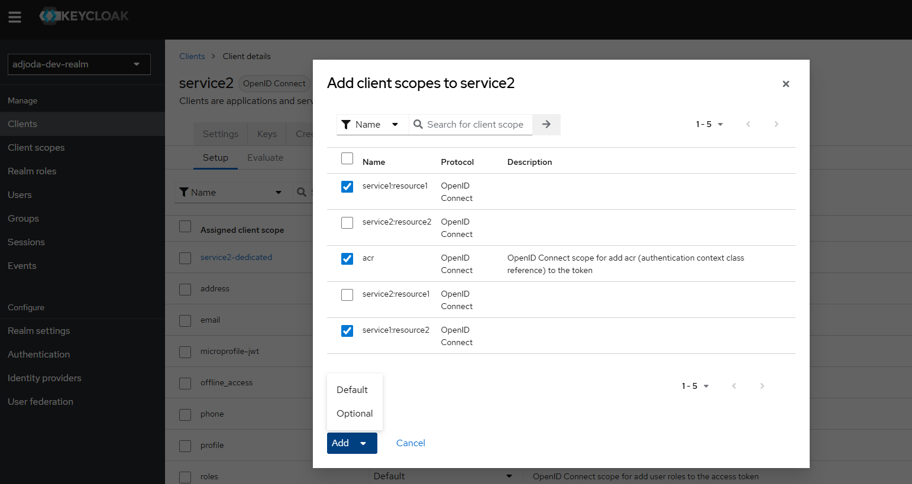

# keycloak en https
mkdir certs
openssl req -x509 -newkey rsa:2048 -keyout certs/key.pem -out certs/cert.pem -days 365 -nodes -subj "/CN=localhost"

cd /mnt/d/dev/git/dev-blog/ecommerce-project/local-deploy/keycloak/certs$

docker run -p 8443:8443 \
-e KEYCLOAK_ADMIN=admin \
-e KEYCLOAK_ADMIN_PASSWORD=admin \
-v "$(pwd)/cert.pem:/opt/keycloak/cert.pem:ro" \
-v "$(pwd)/key.pem:/opt/keycloak/key.pem:ro" \
quay.io/keycloak/keycloak:23.0.6 start-dev \
--https-certificate-file=/opt/keycloak/cert.pem \
--https-certificate-key-file=/opt/keycloak/key.pem \
--https-port=8443

# ngrok
https://dashboard.ngrok.com/domains
ngrok http https://localhost:8443 --url=keycloak.adjoda.com.ngrok.app

# go to https://keycloak.adjoda.com.ngrok.app
   login: amdin 
   pwd: admin

# create realm
  1. 
  2. 
  3. 
  4. 
  5.  the file is located \ecommerce-project\local-deploy\keycloak\realm-export.json
  6.  create user
  7. 
  8. 
  9. 

# l'installation de keycloak dans kubernetes ne marche pas avec l'ingress. car le token-service contient l'ingress et non le DNS de keycloak dans le cluster
==> solution utiliser plus tard une external IP donc LoadBalancer

curl https://keycloak.adjoda.com.ngrok.app/realms/adjoda-dev-realm

curl -X POST -H "Content-Type: application/x-www-form-urlencoded" -d 'grant_type=client_credentials&client_id=service1&client_secret=fCAFm8qAVWRFJLYmbE52kez0A2I89tT0' "https://keycloak.adjoda.com.ngrok.app/realms/adjoda-dev-realm/protocol/openid-connect/token"

{
    "access_token": "eyJhbGciOiJSUzI1NiIsInR5cCIgOiAiSldUIiwia2lkIiA6ICJZMU5RVFloQ2pUdEhOV3JQcW4tQl9YT1lRamY5NEROWWlXb2RlQ2VIZWdJIn0.eyJleHAiOjE3NjM4MTAwMzAsImlhdCI6MTc2MzgwOTczMCwianRpIjoiZTA1OGU0YmYtNDc2MS00MjI1LTg1M2UtMDY0ZWQ4ZmM0NDUzIiwiaXNzIjoiaHR0cHM6Ly9rZXljbG9hay5hZGpvZGEuY29tLm5ncm9rLmFwcC9yZWFsbXMvYWRqb2RhLWRldi1yZWFsbSIsImF1ZCI6ImFjY291bnQiLCJzdWIiOiI3MjM0MjY1NS0wOTQxLTRjZWItYWRmZS0zYzkyMGZlNjg1MGIiLCJ0eXAiOiJCZWFyZXIiLCJhenAiOiJzZXJ2aWNlMSIsImFjciI6IjEiLCJhbGxvd2VkLW9yaWdpbnMiOlsiKiJdLCJyZWFsbV9hY2Nlc3MiOnsicm9sZXMiOlsib2ZmbGluZV9hY2Nlc3MiLCJkZWZhdWx0LXJvbGVzLWFkam9kYS1kZXYtcmVhbG0iLCJ1bWFfYXV0aG9yaXphdGlvbiJdfSwicmVzb3VyY2VfYWNjZXNzIjp7InNlcnZpY2UxIjp7InJvbGVzIjpbInVtYV9wcm90ZWN0aW9uIl19LCJhY2NvdW50Ijp7InJvbGVzIjpbIm1hbmFnZS1hY2NvdW50IiwibWFuYWdlLWFjY291bnQtbGlua3MiLCJ2aWV3LXByb2ZpbGUiXX19LCJzY29wZSI6InNlcnZpY2UyOnJlc291cmNlMiBwcm9maWxlIHNlcnZpY2UyOnJlc291cmNlMSBlbWFpbCIsImNsaWVudEhvc3QiOiIxNzIuMTcuMC4xIiwiZW1haWxfdmVyaWZpZWQiOmZhbHNlLCJwcmVmZXJyZWRfdXNlcm5hbWUiOiJzZXJ2aWNlLWFjY291bnQtc2VydmljZTEiLCJjbGllbnRBZGRyZXNzIjoiMTcyLjE3LjAuMSIsImNsaWVudF9pZCI6InNlcnZpY2UxIn0.Ffen143zmT3IG1Y7aB4Q-Hx6bKttWnrmVPHwlFbwD6MRMg5foXvJk_zasYqQi6mYgbJI9JRuHccRxfRL7t7qE2PoyWYhG1ESczl7LjHvl7HmB1d57cV6tpdyd0YRrMq5Jmz5ROSXF0zOfpewD1SMDXBylEklpBpRUb5wRZ7u8tdqSdfuE98p_0D640zPkxt2ZmROvuWUTvn6wXL46U6Ww9xdjgb2_lSGS0KcJHzZMMm_zZ_uyd0TSCp-Dr8PUAF0pLUVCcHSwW_SLdwOfaf9Ernfwx4Xu7do76yLWbTPoCJL8jsncvFTfaypbmYoFNra5PAH2MyFFI6IZIe3THK24w",
    "expires_in": 300,
    "refresh_expires_in": 0,
    "token_type": "Bearer",
    "not-before-policy": 0,
    "scope": "service2:resource2 profile service2:resource1 email"
}

curl -X POST -H "Content-Type: application/x-www-form-urlencoded" -d 'grant_type=client_credentials&client_id=service2&client_secret=YqtcNpgUGx8bPvQBLJTpGVn4YeNOJHw8' "https://keycloak.adjoda.com.ngrok.app/realms/adjoda-dev-realm/protocol/openid-connect/token"

{
"access_token": "eyJhbGciOiJSUzI1NiIsInR5cCIgOiAiSldUIiwia2lkIiA6ICJZMU5RVFloQ2pUdEhOV3JQcW4tQl9YT1lRamY5NEROWWlXb2RlQ2VIZWdJIn0.eyJleHAiOjE3NjM4MTA0NzQsImlhdCI6MTc2MzgxMDE3NCwianRpIjoiMmZiZjRhYTQtOWI1MS00NTdhLWJiMTgtOGViNDk3ZmY5NmM3IiwiaXNzIjoiaHR0cHM6Ly9rZXljbG9hay5hZGpvZGEuY29tLm5ncm9rLmFwcC9yZWFsbXMvYWRqb2RhLWRldi1yZWFsbSIsImF1ZCI6ImFjY291bnQiLCJzdWIiOiJjMmJmYjA0ZC02ZWQ1LTQ2OGItYjdlMi1jYjRjZjQxYjZmMTIiLCJ0eXAiOiJCZWFyZXIiLCJhenAiOiJzZXJ2aWNlMiIsImFjciI6IjEiLCJhbGxvd2VkLW9yaWdpbnMiOlsiKiJdLCJyZWFsbV9hY2Nlc3MiOnsicm9sZXMiOlsib2ZmbGluZV9hY2Nlc3MiLCJkZWZhdWx0LXJvbGVzLWFkam9kYS1kZXYtcmVhbG0iLCJ1bWFfYXV0aG9yaXphdGlvbiJdfSwicmVzb3VyY2VfYWNjZXNzIjp7InNlcnZpY2UyIjp7InJvbGVzIjpbInVtYV9wcm90ZWN0aW9uIl19LCJhY2NvdW50Ijp7InJvbGVzIjpbIm1hbmFnZS1hY2NvdW50IiwibWFuYWdlLWFjY291bnQtbGlua3MiLCJ2aWV3LXByb2ZpbGUiXX19LCJzY29wZSI6InNlcnZpY2UxOnJlc291cmNlMSBwcm9maWxlIGVtYWlsIHNlcnZpY2UxOnJlc291cmNlMiIsImNsaWVudEhvc3QiOiIxNzIuMTcuMC4xIiwiZW1haWxfdmVyaWZpZWQiOmZhbHNlLCJwcmVmZXJyZWRfdXNlcm5hbWUiOiJzZXJ2aWNlLWFjY291bnQtc2VydmljZTIiLCJjbGllbnRBZGRyZXNzIjoiMTcyLjE3LjAuMSIsImNsaWVudF9pZCI6InNlcnZpY2UyIn0.26_SpWbn3yhisA8t1ILe5KkBvm983g8aTbamfwYjcmN3S1U9t-iIykiDlc8Ri0MYdDDiAnDsbneKV8gqxa_YAFoA7k0aOaJ42QVbREDR1B4lFC1sQ01GF0JmIIUmH2PY_p6VN8X8_j8sCCrtM40AeQpt_ml7cAxWTgE30WBWerfRwBZve4ez_efqcHMpnyKKqQmLttjLwDbDgKINsDvgr_JTCdYKNjDItQRMyeXytT0nNf85zmQNhvXkyM9YQtbUU8eNOx9BQT3feJTtm-c3CxXZjEy0k0elzthZiOvsrfjs35lr-dk3MCbtuyfADIahdDzr8rkSFFLDd6fn-e7iPw",
"expires_in": 300,
"refresh_expires_in": 0,
"token_type": "Bearer",
"not-before-policy": 0,
"scope": "service1:resource1 profile email service1:resource2"
}